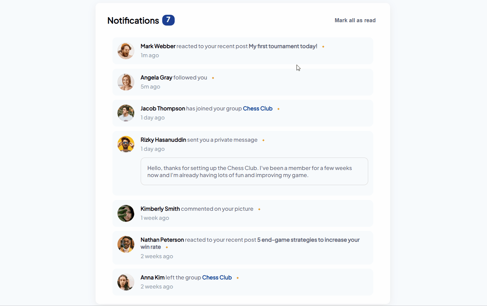
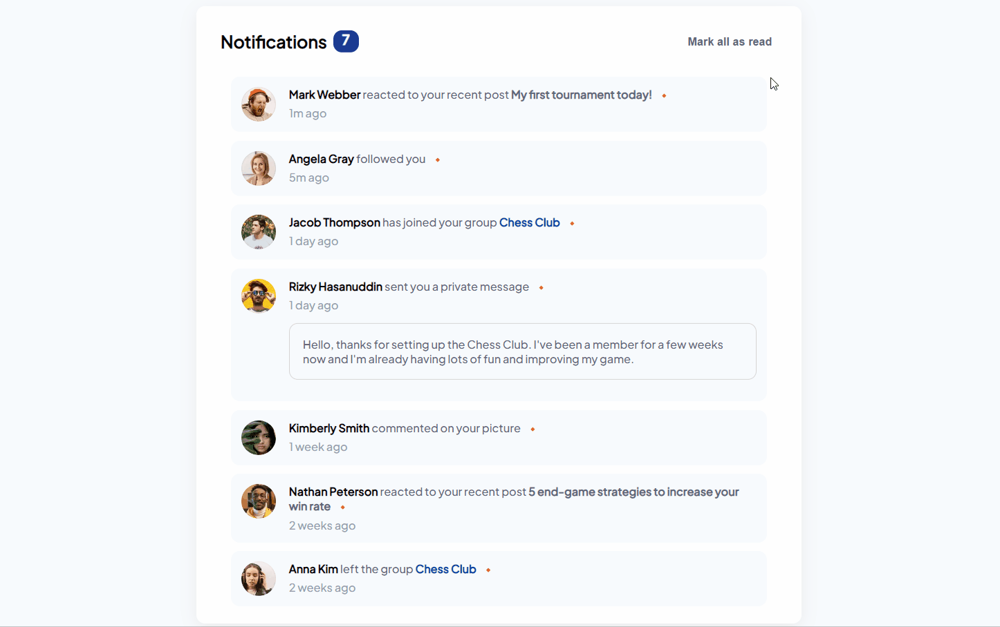
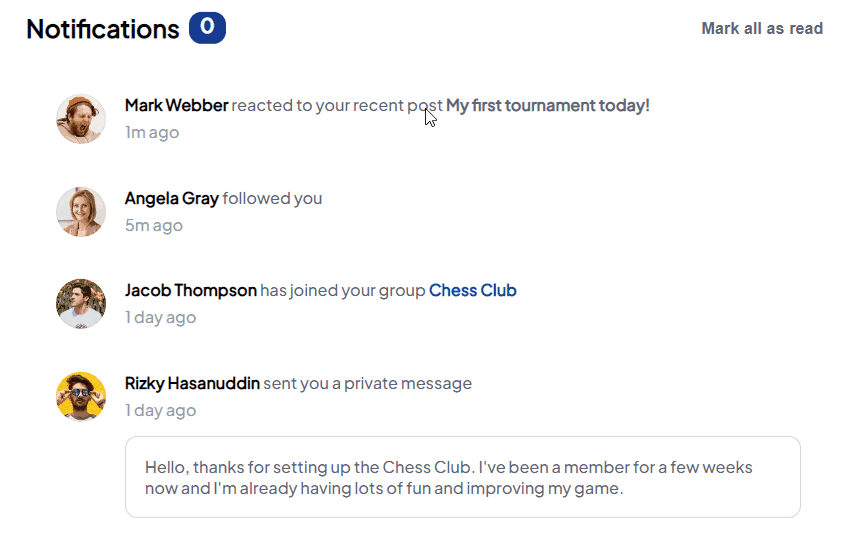
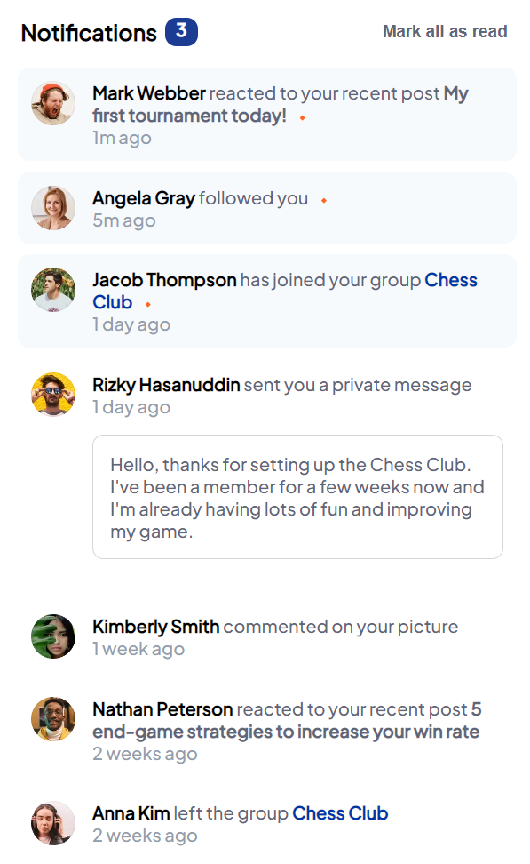

# Notification Page with Vue

#JS #html5 #SCSS #Vue3.x (#Pinia)

github page:
https://hoijoii.github.io/Notification-Page/

- Read notification

- Mark all as read

- Cursor:pointer

- Reactivity

 
---

### Comment

알림 데이터들은 assets/data/content.json에 들어있습니다.
문제는 html 태그도 json에 저장해서 추후 내용을 확인하거나 수정하기 불편하다는 점입니다.
알림을 보내는 기능이 있다면 알림 종류에 따라 메세지가 체계적으로 구성되도록 할 수 있을 것 같습니다.

Notifications are saved in assets/data/content.json because I wanted to load notification data through v-for loop, but the problem is that html tags are also stored as strings in json.
I made it to perform motion simply and I'm trying to make it more legible and reusable.